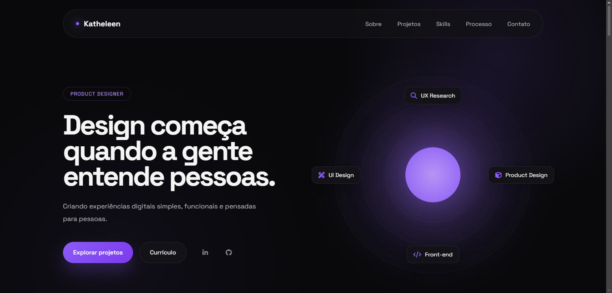

# Portfólio

Meu portfólio pessoal desenvolvido para apresentar meus projetos, habilidades e evolução como Product Designer e Front-end Developer.

## ✨ Sobre

Este projeto foi desenvolvido com foco em uma experiência minimalista, moderna e responsiva, valorizando tipografia, espaçamento e microinterações.

Além de apresentar meus projetos, ele também demonstra minha evolução em desenvolvimento Front-end.

## 🚀 Tecnologias

- HTML5
- CSS3
- JavaScript
- Git
- GitHub

## 🎨 Funcionalidades

- Layout responsivo
- Navegação suave
- Navbar com seção ativa
- Animações ao rolar a página
- Microinterações
- Glow interativo que acompanha o cursor
- Cards de projetos com efeitos de hover

## 📂 Projetos apresentados

- Fake Fraud
- EcoViva
- Portfolio
- Learning Journal

## 📸 Preview

https://katheleenjs.github.io/portfolio/

## 📫 Contato

LinkedIn:
https://www.linkedin.com/in/katheleenjesus/

GitHub:
https://github.com/katheleenjs

Email:
katheleenjds@gmail.com
